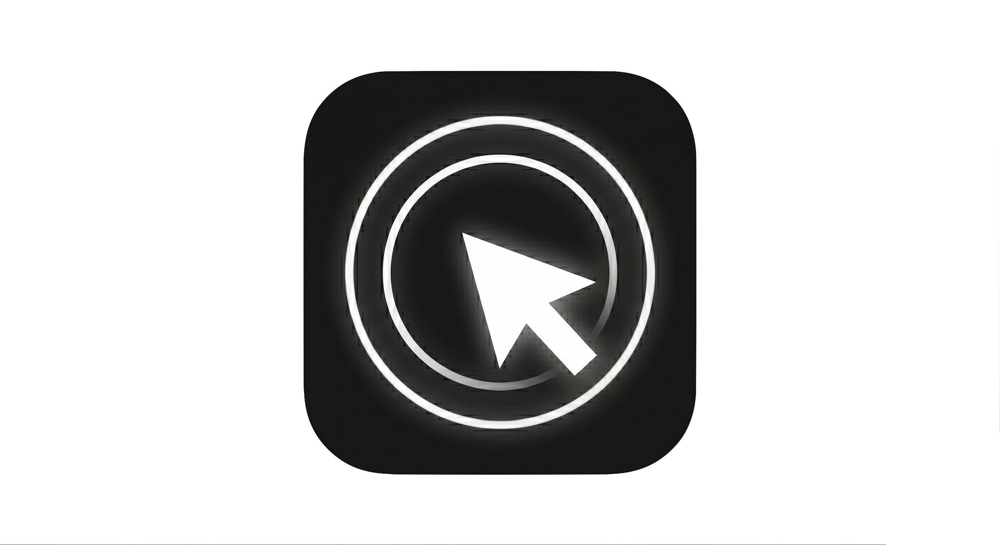

<p align="center">
  
</p>

# Mac Remote

Use your iPhone as a trackpad and keyboard for your Mac — no third-party services, no cloud, runs over your local network or Tailscale.

```
mac-remote/
├── MacRemote/       iOS app (SwiftUI + UIKit)      — Xcode → sideload via LiveContainer
├── MacRemoteMac/    macOS menu bar app (SwiftUI)   — Xcode → run on your Mac
└── releases/
    ├── MacRemote.ipa       pre-built iOS IPA
    └── MacRemoteMac.zip    pre-built macOS app
```

## Features

**Trackpad**
- 1-finger drag → cursor movement (with smooth paint-trail animation)
- 1-finger tap → left click (haptic + ripple)
- 2-finger tap → right click (haptic + ripple)
- 2-finger drag → scroll with momentum
- 1-finger long press → drag-hold, move to drag (sonar pulse animation + haptic)
- 3-finger swipe → ctrl+arrow (Mission Control / space switching)

**Keyboard**
- Sticky modifier keys: ⌘ ⇧ ⌥ ⌃ (cleared after one use)
- Special keys row: esc, tab, return, delete, arrows
- Full software keyboard with backspace and return forwarding
- Hardware / Bluetooth keyboard shortcut forwarding

**Connection**
- WebSocket over local network (LAN) or Tailscale
- Auto-reconnect with exponential backoff
- Token-based auth — copy URL from the Mac menu bar, paste in iOS settings

## Quick start

### Mac app
1. Open `MacRemoteMac/MacRemoteMac.xcodeproj` in Xcode
2. Run on your Mac — a menu bar icon appears
3. Grant Accessibility permission when prompted (required for mouse + keyboard injection)
4. Expand an address row in the menu → Copy URL

Or unzip `releases/MacRemoteMac.zip` and run the app directly.

### iOS app
1. Open `MacRemote/MacRemote.xcodeproj` in Xcode, archive, and sideload the IPA via [LiveContainer](https://github.com/khanhduytran0/LiveContainer)
2. Or sideload `releases/MacRemote.ipa` directly
3. Open the app → Settings → Paste URL from Mac (uses the URL copied above)
4. Tap Save & Connect — the status dot turns green

## How it works

The Mac app runs a WebSocket server (plain TCP, no third-party deps, implemented with `Network.framework`). The iOS app connects as a client. Touch events are serialized as compact JSON frames and injected on the Mac via `CGEvent` and AppleScript (`osascript`) for system-level shortcuts.

Wire protocol: `shared/Protocol.swift` — each frame is a JSON object with a `t` discriminator (`mv`, `click`, `scroll`, `combo`, `text`, …).

## Requirements

- **Mac**: macOS 13+ (Ventura), Accessibility permission
- **iOS**: iOS 16+, sideloading via LiveContainer or a developer account
- **Network**: same LAN, or both devices on [Tailscale](https://tailscale.com)
